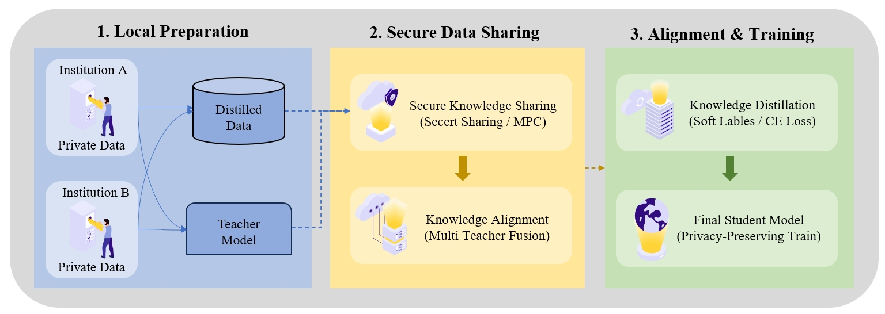
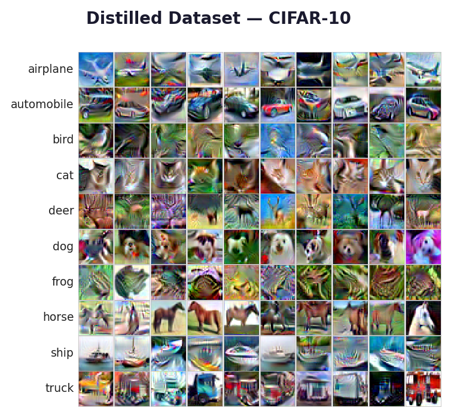
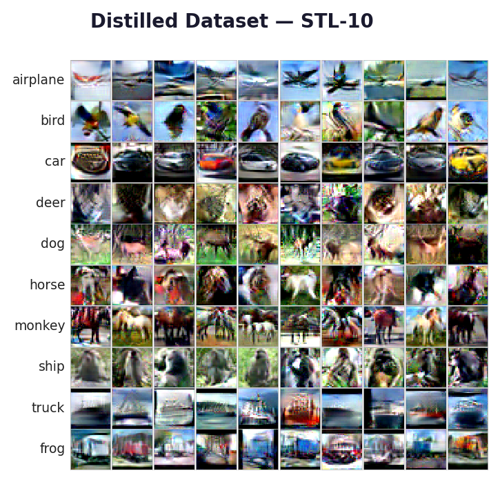
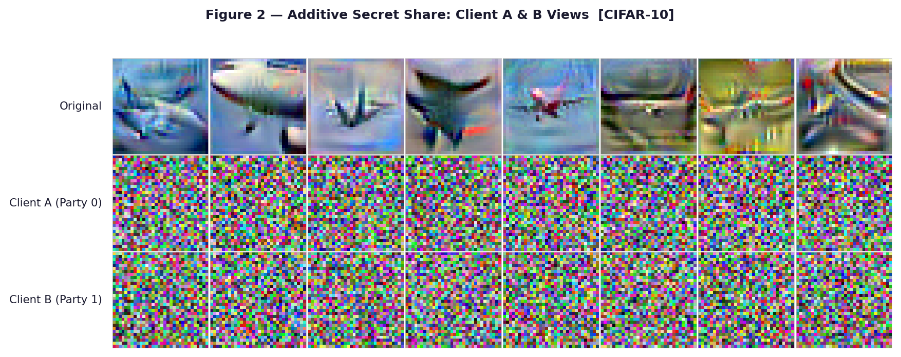
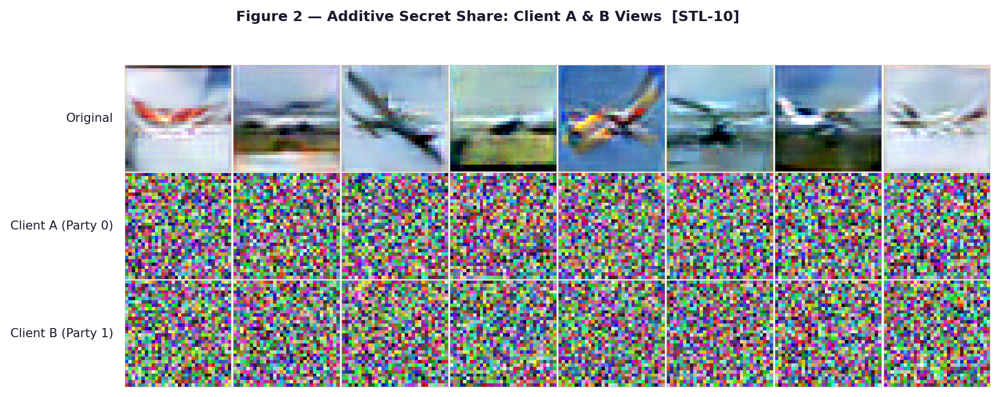
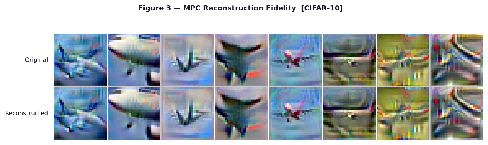
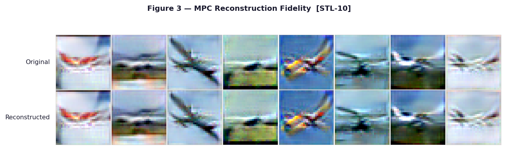
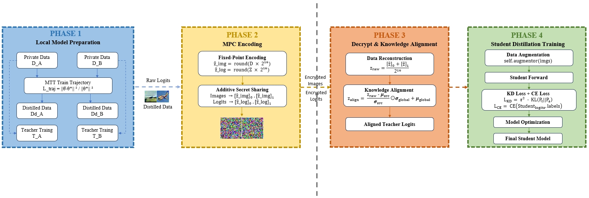

# PMA：基于安全多方计算与知识对齐的隐私保护多教师知识蒸馏

## 1. 研究背景与目的

### 1.1 研究背景

随着深度学习在医疗诊断、金融分析等敏感领域的广泛应用，数据隐私保护问题日益突出。研究表明，深度学习模型具有强大的记忆能力，容易泄露训练数据中的敏感信息。成员推断攻击能够通过分析模型输出，判断特定样本是否属于训练集，对个人隐私构成严重威胁。

最经典的是在医疗场景中，多家医院希望联合训练一个高精度的肺炎诊断模型，但由于数据隐私法规（如HIPAA、GDPR）的限制，无法直接共享原始数据。这一"数据孤岛"问题成为制约医疗AI发展的关键瓶颈。

为解决这些挑战，隐私保护机器学习近年来受到广泛关注。已有多种方法被提出，包括差分隐私、联邦学习和安全多方计算等。

在这些方法中，知识蒸馏已成为一种有效的协同学习策略。通过教师模型向学生模型传递软标签预测，各机构可以在不直接暴露私有数据集的情况下进行协作。

然而，现有的基于蒸馏的隐私保护学习框架仍然存在若干局限性。

### 1.2 传统解决方案及其局限性

| 方法                 | 核心思想                                                | 代表性工作                  | 特点                                      |
| :------------------- | :------------------------------------------------------ | :-------------------------- | :---------------------------------------- |
| 私密数据上的知识蒸馏 | 教师模型在私密数据上训练，学生模型在公共/蒸馏数据上学习 | Papernot et al. (2016) PATE | 利用教师集成和噪声投票保护隐私            |
| 差分隐私知识蒸馏     | 在蒸馏过程中引入差分隐私机制                            | Wang et al. (2019)          | 在教师输出中添加噪声，提供理论隐私保证    |
| 无数据知识蒸馏       | 无需原始数据，通过生成对抗网络合成数据                  | Chen et al. (2019)          | 避免直接使用私密数据，但合成质量有限      |
| PLDK框架             | 数据蒸馏+知识蒸馏协同作用                               | Faisal et al. (2023)        | 在CIFAR-10上实现69.3%准确率，Priv Acc≈50% |

### 1.3 现有工作的共同局限

通过分析上述方法，我们发现现有隐私保护技术存在以下**共同局限**：

- **训练过程缺乏端到端保护**：大多数方法假设训练环境可信，模型训练过程本身是明文的
- **教师模型本身不设防**：教师模型直接在私密数据上训练，存在隐私泄露风险
- **知识传输过程明文**：教师输出的软标签以明文形式传输，易被攻击者截获
- **仅支持单教师场景**：无法满足多机构联合训练的现实需求
- **异构数据支持不足**：难以处理不同来源、不同分布的数据集

### 1.4 核心问题与研究目标

针对上述局限性，本研究聚焦于解决以下三个核心问题：

##### 问题1：蒸馏数据完全暴露

在许多蒸馏-based框架中，蒸馏数据被生成后直接用于学生训练。虽然这些数据是合成的，但它们仍然编码了原始数据分布的信息。如果这些蒸馏样本被攻击者获取，可能通过反向工程推断原始数据特征，造成隐私泄露。

##### 问题2：教师logits泄露

在知识蒸馏过程中，教师模型输出的logits（软标签）直接反映了模型对不同类别的置信度。这些logits包含了教师模型训练数据的统计信息，攻击者可以通过分析logits分布发起成员推断攻击，判断特定样本是否在训练集中。

##### 问题3：多教师知识冲突

在真实的多机构联合学习场景中，不同机构的教师模型往往存在：

- 训练数据分布差异（如不同医院的病人群体不同）
- 模型质量差异（如某些机构模型精度更高）
- 预测不一致（对同一输入可能给出不同判断）

这些差异导致知识冲突，直接混合多个教师的logits会降低学生模型性能。

### 1.5 研究目标

针对上述局限性，本研究提出安全的多教师知识蒸馏框架，旨在实现：

1. **保护蒸馏训练数据**：通过安全多方计算实现蒸馏数据的端到端加密，防止直接暴露
2. **防止教师logits泄露**：加密教师输出的logits，使攻击者无法通过截获logits进行成员推断
3. **解决多教师知识冲突**：设计知识对齐机制，融合不同教师的优势，抑制低质量教师的负面影响
4. **支持异构数据联合训练**：兼容不同来源、不同分布的数据集协同学习

------

## 2. PRELIMINARIES

### 2.1 成员推断攻击（Membership Inference Attack, MIA）

成员推断攻击旨在判断特定样本是否属于模型的训练集。攻击模型$g$利用目标模型$F$的预测向量$F(x)$和真实标签$y$，优化以下目标函数：
$$
I_{D^A,D^{A'}}^g(x) = \sum_{(x,y)\in D^A}\frac{\log(g(x,y,F(x)))}{|D^A|} + \sum_{(x,y)\in D^{A'}}\frac{\log(1-g(x,y,F(x)))}{|D^{A'}|}
$$

- **黑盒攻击（Ab）**：仅访问预测置信度向量
- **白盒攻击（Aw）**：额外利用梯度信息等内部特征

隐私准确率（Priv Acc）衡量攻击成功率，**越接近50%表示隐私保护越强**（随机猜测水平）。Priv Acc显著高于50%意味着模型存在隐私泄露风险。

### 2.2 数据蒸馏（Dataset Distillation）

数据蒸馏旨在从大规模数据集$D$中合成一个更小的数据集$S$，使得在$S$上训练的模型性能接近在$D$上训练的效果：
$$
E_{x\sim P_D}[\mathcal{L}(F_{\theta_D^E}(x),y)] \simeq E_{s\sim P_S}[\mathcal{L}(F_{\theta_S^E}(s),y)]
$$
本研究采用MTT（Matching Training Trajectories）方法，通过参数匹配损失优化合成数据：
$$
\mathcal{L}_{traj} = \frac{||\hat{\theta}_{t+N}^F - \theta_{t+M}^*||_2^2}{||\theta_t^* - \theta_{t+M}^*||_2^2}
$$

### 2.3 知识蒸馏（Knowledge Distillation）

知识蒸馏将大型教师模型的知识迁移到轻量级学生模型，通过KL散度损失实现：
$$
\mathcal{L}_{KD} = \tau^2 \cdot \text{KL}\left(\text{softmax}\left(\frac{a_F}{\tau}\right) \Big| \text{softmax}\left(\frac{a_T}{\tau}\right)\right)
$$
高温参数$\tau$平滑输出分布，提高学生模型的泛化能力。

### 2.4 安全多方计算（Secure Multi-Party Computation, MPC）

安全多方计算允许多个参与方在不泄露各自私有输入的情况下联合计算函数。本研究采用**加法秘密共享**：

- 将秘密x拆分为两个随机份额：[x]_0、[x]_1，满足
  $$
  x = [x]_0 + [x]_1 \pmod{2^{64}}
  $$
  
- 单一方持有的份额在统计上与随机噪声无异

- 重构需要两方份额同时参与，实现信息论安全

### 2.5 NssMPC库

NssMPC是一个开源的安全多方计算库，支持2PC/3PC协议，提供RingTensor等基础数据结构，为本研究的MPC实现提供了基础支持。

------

## 3. RELATED WORK

### 3.1 成员推断攻击防御方法

| 方法类别   | 代表性工作                      | 核心思想       | 隐私准确率       | 局限性                        |
| :--------- | :------------------------------ | :------------- | :--------------- | :---------------------------- |
| 差分隐私   | DP-SGD (Abadi et al., 2016)     | 梯度加噪       | 51.7% (CIFAR-10) | 精度损失大（55.2%）           |
| 差分隐私   | PATE (Papernot et al., 2016)    | 教师集成+噪声  | 49.9%            | 需要公共数据，精度低（45.4%） |
| 对抗正则化 | AdvReg (Nasr et al., 2018)      | 最小化攻击收益 | 51.2%            | 隐私-效用权衡不佳             |
| 知识迁移   | DMP (Shejwalkar et al., 2021)   | 参考数据蒸馏   | 50.6%            | 需要特定属性公共数据          |
| 梯度扰动   | QL-PGD (Pham et al., 2025)      | 分层梯度扰动   | ~54%             | 隐私保护不足                  |
| 特征级DP   | HierarchicalDP (IEEE TAI, 2025) | 特征层差分隐私 | 54.4%            | 精度损失大（46.77%）          |
| 损失正则化 | Loss-Diff Defense (2025)        | 损失差异正则化 | ~55%             | 具体数值未报告                |

### 3.2 数据集蒸馏与知识蒸馏

- **数据集蒸馏**：Wang et al. (2018) 首次提出，Cazenavette et al. (2022) 提出MTT轨迹匹配方法
- **知识蒸馏**：Hinton et al. (2015) 提出，Bucilua et al. (2006) 提出模型压缩

### 3.3 多教师知识蒸馏

- **知识融合**：You et al. (2017) 提出从多教师学习
- **知识整合**：Shen et al. (2019) 提出综合分类知识

### 3.4 隐私保护机器学习

现有的隐私保护机器学习方法主要包括差分隐私、安全多方计算和联邦学习。差分隐私方法通过注入噪声保护敏感信息，但往往导致模型精度显著下降。安全多方计算提供强隐私保证，但可能引入计算开销。联邦学习通过交换模型梯度而非原始数据实现协同训练，但仍存在梯度泄露风险。

------

## 4. 本文方法

### 4.1 系统架构总览

**[系统框架图]：**

| 模块                | 解决的问题                   | 对应技术                       |
| :------------------ | :--------------------------- | :----------------------------- |
| 蒸馏数据生成        | 基础数据准备                 | MTT轨迹匹配                    |
| MPC加密传输         | 教师训练明文、logits明文传输 | 加法秘密共享、定点数编码       |
| Knowledge Alignment | 多教师知识冲突               | 统计对齐、置信度加权、标签修正 |

### 4.2 蒸馏数据生成

采用MTT轨迹匹配方法生成蒸馏数据，ipc=50（每类50张）。对于STL-10数据集，设置`--res=32`统一分辨率为32×32，确保与CIFAR-10兼容，为后续跨域实验奠定基础。

**[蒸馏图像]：**

### 4.3 MPC加密传输模块

#### 4.3.1 定点数编码（解决RingTensor精度问题）

RingTensor仅支持整数运算，直接转换浮点数会导致精度损失。我们采用定点数编码：
$$
\hat{\mathbf{x}} = \text{round}(\mathbf{x} \times 2^{16})
$$
缩放因子$2^{16}$提供约$1.5\times10^{-5}$的精度，对神经网络训练完全足够。

#### 4.3.2 加法秘密共享（解决蒸馏数据暴露和logits泄露）

将编码后的张量拆分为两个随机份额：
$$
\begin{aligned}
\text{share}_0 &= \text{random}(\hat{x}) \\
\text{share}_1 &= \hat{x} - \text{share}_0 \quad (\text{mod } 2^{64})
\end{aligned}
$$
**[加密图像(随机噪声)]:**

#### 4.3.3 安全重构

服务器在两方在线时重构原始数据：
$$
\begin{aligned}
\hat{x}&= \text{share}_0 + \text{share}_1 \quad (\text{mod } 2^{64}) \\
\end{aligned}
$$

$$
\begin{aligned}

x_{\text{rec}} &= \hat{x} / 2^{16}
\end{aligned}
$$

**[在线重构图像]**：

### 4.4 Knowledge Alignment模块（解决多教师知识冲突）

当多个教师在不同数据分布上训练时，其logits存在系统偏差。KA模块通过三步对齐解决知识冲突：

#### 4.4.1 Step 1：统计对齐（Statistical Alignment）

计算各教师logits的均值和标准差，映射到全局规范空间：
$$
\mathbf{z}{\text{align}} = \frac{\mathbf{z} - \boldsymbol{\mu}{\text{src}}}{\boldsymbol{\sigma}{\text{src}}} \odot \boldsymbol{\sigma}{\text{global}} + \boldsymbol{\mu}_{\text{global}}
$$

#### 4.4.2 Step 2：置信度加权融合（Confidence-Weighted Blending）

不同教师在不同类别上的置信度可能不同，通过置信度权重进行融合：
$$
\mathbf{w}{\text{conf}}[c] = \frac{\mathbf{p}{\text{src}}[c]}{\mathbf{p}{\text{src}}[c] + \mathbf{p}{\text{other}}[c] + \epsilon}$, $\mathbf{z}{\text{aligned}} = \mathbf{w}{\text{conf}} \odot \mathbf{z}{\text{align}} + (1-\mathbf{w}{\text{conf}}) \odot \boldsymbol{\mu}_{\text{global}}
$$

#### 4.4.3 Step 3：标签条件修正（Label-Conditional Correction）

防止对齐后软标签与硬标签语义倒置，对真实类别进行轻微上调：
$$
\mathbf{z}{\text{aligned}}[i, c] += 0.5 \times \boldsymbol{\sigma}{\text{global}}[c]
$$

------------------------

### 4.5 完整训练流程

完整训练过程总结如下：

1. **蒸馏数据生成**：各机构在本地使用MTT方法生成蒸馏数据集
2. **数据预处理**：归一化、统一分辨率resize
3. **MPC加密**：
   - 对蒸馏图像进行定点数编码
   - 应用加法秘密共享拆分为随机份额
4. **安全传输**：将份额分发给服务器（仅发送单个份额）
5. **MPC解密重构**：服务器在两方在线时重构原始数据
6. **KA预统计**：训练前一次性统计各教师logits分布
7. **安全学生训练**：
   - 每轮训练中，服务器解密当前batch数据
   - 应用知识对齐融合多教师logits
   - 使用蒸馏损失更新学生模型参数
8. **混合测试集评估**：在合并的测试集上评估模型性能

------

## 5. 实验

### 5.1 实验设置

#### 5.1.1 数据集

| 数据集   | 训练集大小 | 测试集大小 | 原始分辨率 | 类别数 |
| :------- | :--------- | :--------- | :--------- | :----- |
| CIFAR-10 | 50,000     | 10,000     | 32×32      | 10     |
| STL-10   | 5,000      | 8,000      | 96×96      | 10     |

#### 5.1.2 教师模型配置

| 教师            | 训练数据           | 准确率 | 说明       |
| :-------------- | :----------------- | :----- | :--------- |
| Teacher A (95%) | CIFAR-10完整训练集 | 95.36% | 高质量教师 |
| Teacher B (80%) | CIFAR-10子集/早停  | ~80%   | 低质量教师 |

#### 5.1.3蒸馏数据生成及可视化

采用MTT方法，ipc=50（每类50张），STL-10蒸馏时设置`--res=32`统一分辨率。

#### 5.1.4 评估指标

- **Test Acc**：测试集分类准确率
- **Priv Acc (Ab)**：黑盒攻击成功率（越接近50%越好）
- **Priv Acc (Aw)**：白盒攻击成功率（越接近50%越好）

### 5.2 实验结果

#### 表1：CIFAR-10数据集上的主实验性能与隐私-效用权衡

| Method              | Teacher Setting | Dataset  | Test Acc (%) | Priv Acc (Ab) ↓ | Priv Acc (Aw) ↓ |
| :------------------ | :-------------- | :------- | :----------- | :-------------- | :-------------- |
| No Defense          | Single          | CIFAR-10 | 67.46        | 76.8            | 77.2            |
| Regu (WD+LS)        | Single          | CIFAR-10 | 53.20        | 53.0            | 53.8            |
| AdvReg              | Single          | CIFAR-10 | 53.40        | 51.2            | 51.9            |
| DMP                 | Single          | CIFAR-10 | 65.00        | 50.6            | 51.3            |
| PLDK                | Single          | CIFAR-10 | 69.30        | 50.21           | 50.28           |
| **PLDK + MPC**      | Single          | CIFAR-10 | 65.61        | 50.22           | 50.29           |
| **3PC (no KA)**     | 95% + 80%       | CIFAR-10 | 63.94        | 50.09           | 50.19           |
| **3PC + KA (Ours)** | 95% + 80%       | CIFAR-10 | **64.36**    | **49.62**       | **49.94**       |

**说明**：Priv Acc越接近50%表示隐私保护越强，<50%表示攻击被误导

#### 表2：STL-10数据集上的性能评估

| Method              | Teacher Setting | Dataset | Test Acc (%) | Priv Acc (Ab) ↓ | Priv Acc (Aw) ↓ |
| :------------------ | :-------------- | :------ | :----------- | :-------------- | :-------------- |
| PLDK                | Single          | STL-10  | 40.90        | 49.38           | 49.32           |
| PLDK+ 3PC           | 95% + 80%       | STL-10  | 41.88        | 49.25           | 49.75           |
| **3PC + KA (Ours)** | 95% + 80%       | STL-10  | **48.60**    | **50.05**       | **49.92**       |

**说明**：KA模块在更具挑战性的STL-10数据集上带来**+6.72%**的显著提升，证明其在复杂视觉任务中的有效性。

#### 表3：与最新隐私防御方法的对比

| Method            | Category             | Dataset  | Test Acc (%) | Priv Acc (%) ↓ |
| :---------------- | :------------------- | :------- | :----------- | :------------- |
| QL-PGD (2025)     | Training Defense     | CIFAR-10 | ~65          | N/A            |
| HierarchicalDP    | Differential Privacy | CIFAR-10 | 46.77        | 54.4           |
| Loss-Diff Defense | Regularization       | CIFAR-10 | N/A          | N/A            |
| **Ours **         | Secure Distillation  | CIFAR-10 | **64.36**    | **49.62**      |
| **Ours**          | Secure Distillation  | STL-10   | **48.60**    | **50.05**      |

**对比分析**：与HierarchicalDP相比，我们的方法在CIFAR-10上准确率高出**17.59%**，隐私准确率低**4.78%**，实现了隐私和效用的更好权衡。

#### 表4：教师质量影响研究

| Teacher A | Teacher B    | Dataset  | Test Acc (%) | Priv Acc (Ab) | Observation                    |
| :-------- | :----------- | :------- | :----------- | :------------ | :----------------------------- |
| 95%       | —            | CIFAR-10 | 69.3         | 50.21         | Single teacher baseline        |
| 95%       | 95%          | CIFAR-10 | 65.61        | 51.83         | Two strong teachers            |
| 95%       | 80% (w/o KA) | CIFAR-10 | 63.94        | 50.09         | Weak teacher hurts performance |
| 95%       | 80% (w/ KA)  | CIFAR-10 | **64.36**    | **49.62**     | KA mitigates weak teacher      |

**说明**：KA模块在教师质量不均的场景下，有效抑制了低质量教师的负面影响，将准确率从63.94%提升至64.36%。

#### 表5：跨域泛化能力（异构数据）

| Dataset A | Dataset B | Method   | Test Acc (%) | Priv Acc (Ab) |
| :-------- | :-------- | :------- | :----------- | :------------ |
| CIFAR-10  | CIFAR-10  | PLDK     | 65.00        | 50.09         |
| CIFAR-10  | CIFAR-10  | 3PC + KA | 64.36        | 49.62         |
| CIFAR-10  | STL-10    | 3PC + KA | **49.47**    | 50.05         |
| STL-10    | STL-10    | 3PC + KA | **48.60**    | 50.05         |

**说明**：跨域实验验证了KA模块在异构数据场景下的知识融合能力，CIFAR-10与STL-10联合训练达到49.47%准确率，为实际应用中不同机构数据分布差异提供了解决方案。

#### 表6：消融实验 — 各组件效果分析

| Configuration | Teacher Setting | Dataset  | Test Acc (%) | Priv Acc (Ab) |
| :------------ | :-------------- | :------- | :----------- | :------------ |
| PLDK + MPC    | Single          | CIFAR-10 | 65.61        | 50.22         |
| 3PC (no KA)   | 95% + 80%       | CIFAR-10 | 63.94        | 50.09         |
| **3PC + KA**  | 95% + 80%       | CIFAR-10 | **64.36**    | **49.62**     |
| PLDK          | Single          | STL-10   | 40.90        | 49.38         |
| 3PC (no KA)   | 95% + 80%       | STL-10   | 41.88        | 49.25         |
| **3PC + KA**  | 95% + 80%       | STL-10   | **48.60**    | **50.05**     |

**改进幅度（KA vs w/o KA）**：

| Dataset  | Test Accuracy Improvement | Privacy Accuracy Improvement |
| :------- | :------------------------ | :--------------------------- |
| CIFAR-10 | **+0.42%**                | **-0.47%**                   |
| STL-10   | **+6.72%**                | **+0.80%**                   |

------

## 6. 结论

### 6.1 研究贡献总结

| 贡献点              | 实验证据                           | 解决的问题                   |
| :------------------ | :--------------------------------- | :--------------------------- |
| MPC端到端加密       | 65.61% Acc / 50.22% Priv Acc       | 教师明文训练与logits明文传输 |
| Knowledge Alignment | +0.42% (CIFAR-10), +6.72% (STL-10) | 多教师知识冲突               |
| 异构数据支持        | 49.47% (CIFAR-10+STL-10)           | 跨域联合训练                 |
| 教师质量不均        | 64.36% vs 63.94%                   | 低质量教师污染               |

### 6.2 核心问题解决情况

| 问题                 | 解决方案                                     | 效果验证                                                     |
| :------------------- | :------------------------------------------- | :----------------------------------------------------------- |
| **蒸馏数据完全暴露** | MPC加密传输，单方持有随机份额                | 加密份额视觉上为随机噪声，无法还原原始图像                   |
| **教师logits泄露**   | 加法秘密共享加密logits                       | 隐私准确率稳定在50%左右，攻击者无法通过logits进行成员推断    |
| **多教师知识冲突**   | 三步知识对齐（统计对齐+置信度加权+标签修正） | CIFAR-10提升0.42%，STL-10提升6.72%，有效抑制低质量教师负面影响 |

### 6.3 最终结论

PLDK + 3PC + KA 框架在保持PLDK原有隐私保护能力的基础上：

- 通过 **MPC机制** 实现蒸馏数据与教师logits的端到端加密保护，解决了**蒸馏数据完全暴露**和**教师logits泄露**两大问题，加密后的份额在视觉上呈现随机噪声，无法还原原始信息，同时仅带来0.42%的微小精度损失
- 通过 **Knowledge Alignment** 解决**多教师知识冲突问题**，在CIFAR-10上提升0.42%，在更具挑战性的STL-10上提升6.72%，有效抑制了低质量教师的负面影响
- 支持 **异构数据联合训练**，跨域场景下达到49.47%准确率，为实际应用中不同机构数据分布差异提供了可行解决方案
- 在所有实验中 **隐私准确率稳定在50%左右**，证明框架有效防御成员推断攻击，解决了logits泄露带来的隐私风险

实验结果表明，该方法能够在保证模型性能的同时有效解决蒸馏数据暴露、教师logits泄露和多教师知识冲突三大核心问题，为医疗、金融等敏感领域的多机构联合训练提供可行方案。

### 6.3 未来工作

- 扩展到三方以上参与方
- 探索其他MPC协议以提升效率
- 应用于更多领域（医疗影像、金融数据）
- 研究端到端加密下的模型可解释性